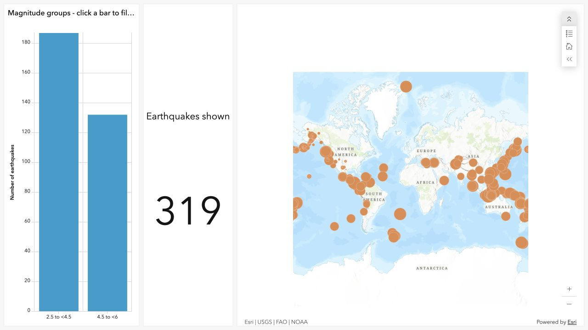
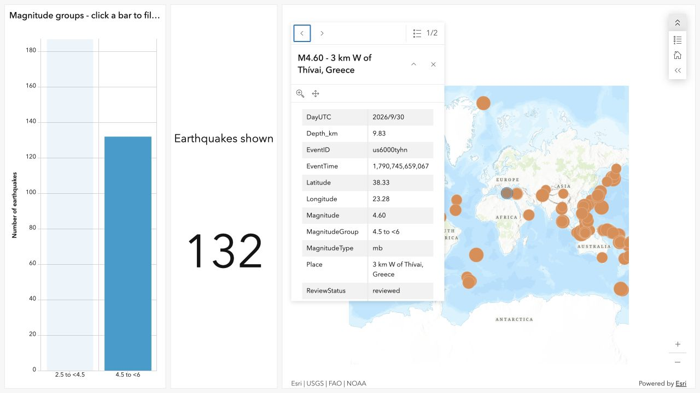

# Global Earthquake Explorer: A Seven-Day Snapshot

Jiapei Mei · SSCI 591 Project 2

**Report draft:** The ArcGIS application is published and tested. Review this draft before submission; builder and code screenshots still need to be included.

## 1. Introduction

This project explores where earthquakes occurred around the world during a seven-day period and how their reported magnitudes differ. The intended users are students and other people who want a simple introduction to earthquake patterns. The study area is global because earthquake events occur across national boundaries. The application is designed to let users filter earthquakes by magnitude and select a point to read its location, time, and depth.

The project uses a fixed snapshot rather than a continuously changing feed. This makes the map and summary statistics reproducible. It is an educational overview and should not be used for emergency decisions or earthquake prediction.

## 2. Data and preparation

The data come from the USGS Earthquake Hazards Program's M2.5+ seven-day GeoJSON feed (U.S. Geological Survey [USGS], n.d.-a). The archived response was generated on October 4, 2026, at 19:51:31 UTC. I used a bulk dataset instead of creating earthquake locations manually.

The original response contains 325 records. The preparation script checks unique event identifiers, event type, magnitude values, and coordinate validity. Six events below magnitude 2.5 were excluded, leaving 319 records. The output includes the event identifier, magnitude, magnitude group, place description, UTC time, depth in kilometers, coordinates, review status, magnitude type, and a link to the USGS event page. The original response and processing metadata are preserved with the project.

The source coordinate system is WGS84 geographic coordinates (EPSG:4326), with longitude before latitude. The third source coordinate contains earthquake depth in kilometers. I moved this value to a separate `Depth_km` attribute and kept two-dimensional point geometry. The ArcGIS upload wizard identifies the hosted output coordinate system as WGS 1984 Web Mercator.

A hosted feature layer titled *Global Earthquakes — 7-Day Snapshot* was created in ArcGIS Online. Its item identifier is `8c39b77313dd4aab8fdcdc3d57cd8c50`. Anonymous access and the count of 319 published features were verified.

## 3. Application methods

The application uses ArcGIS Dashboards with a saved public Web Map. Circle size represents numeric magnitude. Event popups show the magnitude, location, time, depth, and USGS source link. A bar chart groups events into magnitude ranges. Its selection action filters both the map layer and an earthquake count indicator. The chart count axis starts at zero. The map includes a legend, zoom buttons, and an initial-view control. The Web Map overrides the layer scale restriction so points remain visible at global scale.

An HTML wrapper provides a title, introduction, source acknowledgment, and an iframe for the Dashboard. A separate Leaflet preview was developed to inspect the prepared data before completing the Esri application. The preview is not the final ArcGIS deliverable.

**Figure 2 pending:** Dashboard builder screenshot showing the configured map and widgets.

**Figure 3 pending:** Screenshot of the HTML embedding code.

## 4. Results

The prepared dataset contains 187 events with magnitudes from 2.5 to below 4.5, 132 from 4.5 to below 6, and no events at magnitude 6 or above. The largest reported magnitude is 5.9. The retained event times range from September 27, 2026, at 20:49:20 UTC to October 4, 2026, at 18:56:14 UTC.

Public Dashboard: https://www.arcgis.com/apps/dashboards/2e0b3c22e92445f4ac493915b46173cc

The Dashboard was configured in Chrome and tested without ArcGIS sign-in in the Codex in-app browser. The initial count was 319. Selecting the magnitude 4.5 to below 6 bar changed the count to 132 and filtered the map. Selecting a point opened the event popup; a Greece event displayed magnitude 4.60, depth 9.83 km, and its USGS link. Reloading restored 319 records. The app uses a desktop layout; a dedicated mobile layout and independent Safari/Firefox testing were not completed.

## 5. Discussion and comparison

A comparable application is USGS Latest Earthquakes (USGS, n.d.-b), which provides an official interface for exploring earthquake information. My project has a narrower purpose: it presents a fixed seven-day dataset with a small number of controls and summary statistics. The fixed snapshot makes the results easier to explain and reproduce, but it cannot provide current earthquake information after the download date.

The dataset also has limitations. Reporting completeness differs across regions, event locations and magnitudes may be revised, and magnitude types vary between records. A seven-day pattern cannot be used to estimate long-term earthquake risk. A future version could support a longer time range and clearly identify when its data were refreshed.

## 6. References

U.S. Geological Survey. (n.d.-a). *GeoJSON summary format*. Earthquake Hazards Program. https://earthquake.usgs.gov/earthquakes/feed/v1.0/geojson.php

U.S. Geological Survey. (n.d.-b). *Latest earthquakes*. Earthquake Hazards Program. https://earthquake.usgs.gov/earthquakes/map/

## Assistance disclosure

AI assistance was used to help prepare the processing script, local preview, documentation, and this report draft. The final report must accurately describe the application that was published and the tests that were actually performed.

## Published website

https://mjp123-creator.github.io/ssci591-project1/project2/earthquakes/

GitHub Pages deployment succeeded. The public HTML page and embedded Dashboard loaded without signing in, displaying 319 events.
